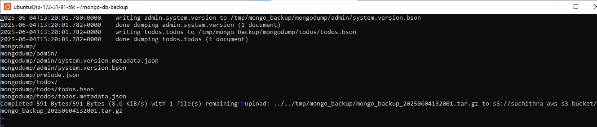
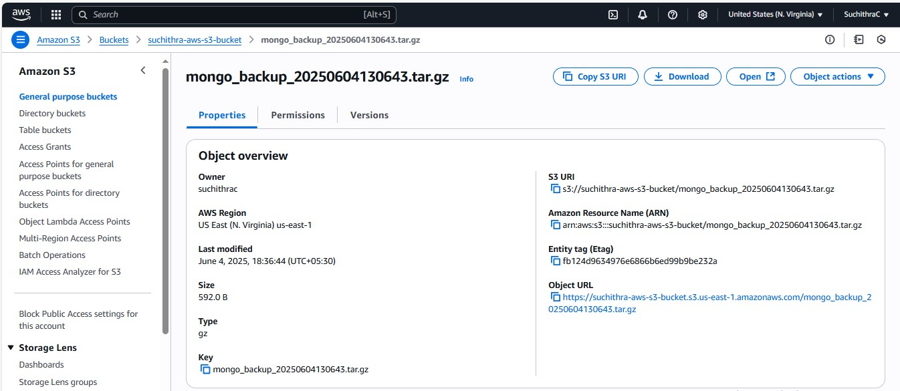
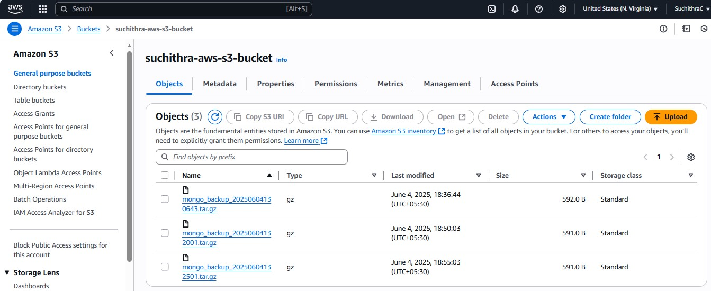

# Automated MongoDB Backup to AWS S3
Automated MongoDB backup that compresses and uploads data to AWS S3 on a scheduled basis using cron jobs in an EC2 instance

## Features

-  **Automated Backups** using `mongodump`
-  **Compression** of backup files into `.tar.gz`
-  **Upload to AWS S3** using AWS CLI
-  **Scheduled Execution** via Ubuntu EC2 instance `cron`
-  Uses IAM Role for secure S3 access
-  Cost-effective: Stop/terminate instance after backup

---

## Tech Stack

- **OS**: Ubuntu 22.04 (EC2)
- **Database**: MongoDB
- **Cloud**: AWS EC2, AWS S3
- **Automation**: `cron`
- **Tools**: `mongodump`, `tar`, `aws-cli`, `bash`

---

## Setup Steps 

### 1.  Launch an EC2 Instance
- Use Ubuntu 22.04
- Attach IAM Role with S3 PutObject permission

### 2.  Install Required Packages
```
sudo apt update
sudo apt install -y awscli gnupg curl tar
```
##### Install MongoDB tools:
```
wget -qO - https://www.mongodb.org/static/pgp/server-6.0.asc | sudo apt-key add -
echo "deb [ arch=amd64 ] https://repo.mongodb.org/apt/ubuntu focal/mongodb-org/6.0 multiverse" | sudo tee /etc/apt/sources.list.d/mongodb-org-6.0.list
sudo apt update
sudo apt install -y mongodb-database-tools
```

### 3. Create the Backup Script

- File in Ubuntu EC2 instance: mongo_backup.sh
- Make it executable: chmod +x mongo_backup.sh   

### 4: Create S3 Bucket & Set Policies
- 1. Create an S3 Bucket
      Go to the AWS Console → S3 → Create bucket
       - Fill out:
       -  Bucket name: suchithra-aws-s3-bucket (or any unique name)
       -  Region: same as EC2 instance region
       -  Keep rest default (versioning, encryption optional)
       -  Click Create bucket

- 2. Attach IAM Permissions for EC2 Upload
       Use an IAM Role for EC2
       - Go to IAM Roles
       - Click Create role
          ```
          Trusted entity type: Select AWS service
          Use case: Select EC2
          Click Next
          ```
- 3. Attach Permissions Policy
        Search for and select:
```
json

{
  "Version": "2012-10-17",
  "Statement": [
    {
      "Effect": "Allow",
      "Action": ["s3:PutObject"],
      "Resource": "arn:aws:s3:::suchithra-aws-s3-bucket/*"
    }
  ]
}
```
Then attach that policy.

- 4. Assign Role to EC2 Instance
     - Go to EC2 → Instances
     - Select the instance → Click Actions → Security → Modify IAM Role
     - Attach the role created

## Screenshots

### Final Output Example

#### 1. EC2 Cron Log Output (cron.log)



#### 2. S3 Console View

    

 

## Cost effective tips:

To avoid ongoing AWS service usage billing, stop or terminate EC2 instance and delete S3 bucket 


